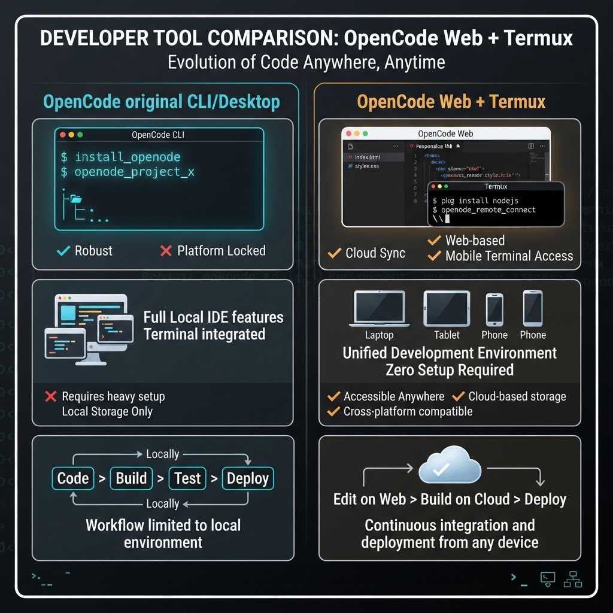

# OpenCode Web + Termux

A web-native OpenCode-inspired workspace plus a standalone Android/Termux CLI. Use the same project-oriented workflow from a browser, desktop terminal, or Android device.

> This project is an independent web and Termux client inspired by the public OpenCode project. It does not replace or modify the original OpenCode distribution.



## Why this version

OpenCode Web + Termux keeps the fast, keyboard-first spirit of the original while adding a browser workspace and a practical Android path:

| Capability | Original OpenCode CLI/Desktop | OpenCode Web + Termux |
| --- | --- | --- |
| Terminal-first workflow | Yes | Yes |
| Browser workspace | Not the primary experience | Yes: chat, files, editor, terminal |
| Android support | Requires a compatible runtime/setup | Native Termux install path |
| Build and Plan modes | Yes | Yes |
| Local project access | Yes | Yes in Termux |
| Provider choice | OpenCode provider configuration | OpenAI-compatible endpoint configuration |
| Session-oriented workflow | Yes | Yes, with web workspace affordances |
| Safe command guardrails | Runtime-dependent | Rejects shell chaining, redirects, pipes, backticks, and expansion |
| Installation | Desktop/runtime-specific | Web preview or one-command Termux installer |

## Features

- Agent workspace with Build and Plan modes.
- Project/session-oriented workflow.
- File explorer, editor preview, terminal panel, and conversation timeline.
- Standalone Termux CLI for Android phones and tablets.
- Provider-neutral configuration using an OpenAI-compatible API shape.
- Environment variables override project and user config files.
- Explicit command execution with shell-operator safety checks.
- No API keys are stored in the repository.
- Responsive web UI for desktop and mobile browsers.

## Web application

### Requirements

- Node.js 20 or newer
- pnpm

### Install and run

```bash
git clone https://github.com/SoloFFCreator/opencode-web-termux.git
cd opencode-web-termux
pnpm install
pnpm dev
```

Open `http://localhost:3000` in a browser.

### Production check

```bash
pnpm build
pnpm start
```

The web workspace is currently a local UI prototype. Its interaction model is designed to mirror OpenCode concepts while the Termux package provides the executable local CLI path.

## Android / Termux installation

Install the current Termux app from [F-Droid](https://f-droid.org/packages/com.termux/) or the official Termux source. Avoid mixing Termux APKs from different sources because Android signature mismatches can prevent package updates.

### Recommended one-command install

Inside Termux:

```sh
pkg update -y
pkg install -y curl
curl -fsSL https://raw.githubusercontent.com/SoloFFCreator/opencode-web-termux/master/scripts/install-termux.sh | bash
```

Restart Termux or reload your shell, then verify:

```sh
opencode --help
```

The installer installs Node.js, Git, downloads the repository, builds the CLI, and places the `opencode` launcher in `$PREFIX/bin`.

### Manual Termux install

```sh
pkg update -y
pkg upgrade -y
pkg install -y git nodejs-lts

git clone https://github.com/SoloFFCreator/opencode-web-termux.git ~/opencode-web-termux
cd ~/opencode-web-termux
npm install
npm run termux:build
ln -sf "$PWD/packages/termux-cli/dist/index.js" "$PREFIX/bin/opencode"
chmod +x packages/termux-cli/dist/index.js
opencode --help
```

For projects stored in shared Android storage:

```sh
termux-setup-storage
cd ~/storage/shared/YourProject
```

## Configure a provider

The CLI accepts any provider exposing an OpenAI-compatible chat endpoint. Set these variables in your shell profile, or use a config file:

```sh
export OPENCODE_BASE_URL=https://provider.example/v1
export OPENCODE_MODEL=your-model
export OPENCODE_API_KEY=your-key
```

Persistent configuration:

```sh
mkdir -p ~/.config/opencode
cp examples/opencode.json.example ~/.config/opencode/config.json
nano ~/.config/opencode/config.json
```

Project configuration can be placed at `.opencode.json`. Resolution order is:

1. Environment variables
2. Project `.opencode.json`
3. User `~/.config/opencode/config.json`
4. Built-in defaults

Never commit API keys. Use a secret manager or Termux environment configuration for production use.

## CLI usage

```sh
opencode
opencode "inspect the authentication flow"
opencode --plan
opencode --cwd ~/storage/shared/YourProject
```

Inside the interactive client:

- `p` switches between Build and Plan modes.
- `Tab` switches between chat and terminal views.
- `n` starts a new session.
- `q` exits.
- Enter submits a prompt.

The terminal allows one explicit command at a time. Shell operators such as `|`, `>`, `&&`, `;`, backticks, `$()` and wildcard expansion are rejected intentionally.

## CLI development

```bash
pnpm termux:test
pnpm termux:build
pnpm termux
```

The CLI source lives in `packages/termux-cli/src`. Configuration behavior is covered by `config.test.ts`.

## Updates and removal

Update the Termux installation:

```sh
cd ~/opencode-web-termux
git pull
npm install
npm run termux:build
```

Remove it:

```sh
rm -rf ~/opencode-web-termux
rm -f "$PREFIX/bin/opencode"
```

## Security notes

This software can read and modify files in the directory where it runs and can execute commands you explicitly submit. Review provider permissions, keep API keys private, use a dedicated project directory, and do not run untrusted prompts with sensitive files mounted.

The command guardrails reduce accidental shell composition but are not a complete sandbox. For untrusted code, use a separate Android user, container, VM, or remote development environment.

## Original OpenCode comparison

The original OpenCode project is the reference implementation for the terminal/desktop agent experience: [github.com/anomalyco/opencode](https://github.com/anomalyco/opencode).

This repository focuses on portability and presentation:

- Original: optimized around its own CLI and desktop runtime.
- This version: adds a browser workspace and a Termux-native distribution path.
- Original: provider/runtime behavior follows its own upstream architecture.
- This version: intentionally uses a small provider-neutral OpenAI-compatible configuration layer.
- Original: upstream feature parity depends on the official release.
- This version: prioritizes a simple install, inspectable source, and Android usability.

This is a complementary client/workspace, not a claim of complete upstream feature parity. Check upstream release notes before relying on a feature for production.

## Project layout

```text
app/                         Next.js web workspace
packages/termux-cli/         Standalone Termux CLI
scripts/install-termux.sh    Android installer
examples/                    Provider configuration example
TERMUX.md                    Short Android guide
```

## License and attribution

Review the repository license before redistributing this project. OpenCode is maintained by [Anomaly](https://github.com/anomalyco); refer to the upstream repository for its license, trademarks, and official releases.
